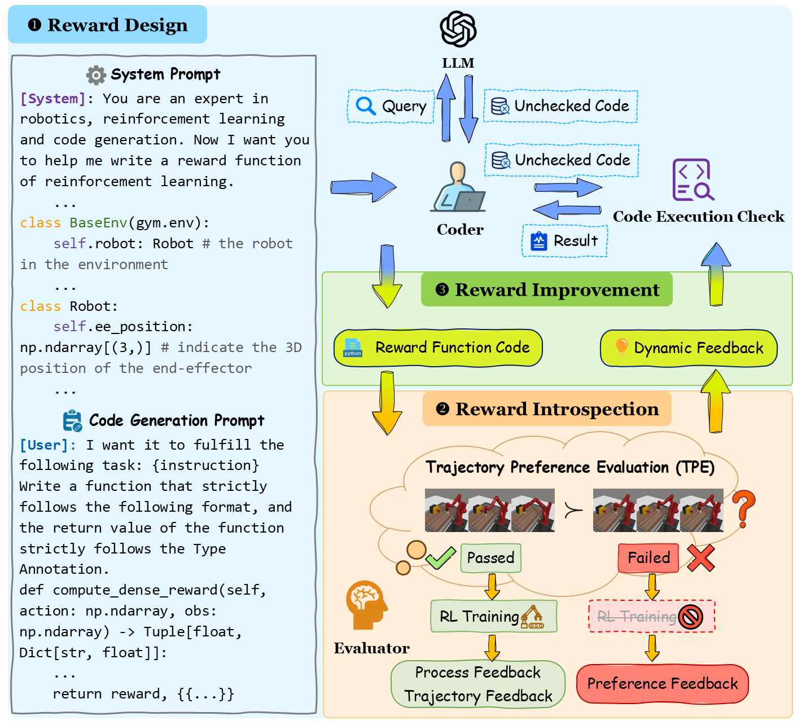

# CARD: A Large Language Model-Driven Reward Design Framework via Dynamic Feedback for Reinforcement Learning (KBS 2025)

Code for paper "A Large Language Model-Driven Reward Design Framework via Dynamic Feedback for Reinforcement Learning" [[KBS 2025]](https://www.sciencedirect.com/science/article/pii/S0950705125011104) [[arXiv]](https://arxiv.org/abs/2410.14660)

CARD can automatically design the reward functions throughout the entire process without human intervention. Through reward introspection, CARD can timely detect whether it has deviated from the optimization objective and skip unnecessary RL training. This reduces token consumption and RL training costs, resulting in more efficient iterative improvement of reward functions while ensuring similar or better performance. The illustration of our method can be found below.




## Dependencies
To set up the environment, run these commands in the shell:
```shell
# conda
conda create -n card python=3.8
conda activate card
# set up environment
cd CARD
bash install/install.sh
# please add the environment variable to your `.bashrc` (or `.zshrc`, etc.)
export OPENAI_API_KEY=YOUR_OPENAI_API_KEY
```

## How to run

CARD optimizes the reward function through an iterative process. In the implementation, two parts of the code need to be executed repeatedly.

### Meta-World
1. Setup (step=0)
```shell
cd CARD/code_generation/self_reflection/
python metaworld_exp_one_step.py --exp_name card --task_name "door-unlock-v2" --llm_model_name "gpt-4-1106-preview" --temperature 0.7 --eval_freq 16_000 --train_max_steps 1_000_000 --train_seed_num 1 --n_eval_episodes 10 --use_return_check --threshold 0.8 --step {step}
```
This process generates a file named `rl_query_code_{step}.pkl`.

2. Reward Design (step=0)
```shell
python query_llm_metaworld.py --rl_question_file_path {rl_question_file_path}
```

`rl_question_file_path` is the path of file `rl_query_code_{step}.pkl`. This process generates a directory `log_path` of the form `./logs/.../code_{step}`.

3. Reward Introspection and Reward Improvement (step=1)
```shell
python metaworld_exp_one_step.py --exp_name card --task_name "door-unlock-v2" --llm_model_name "gpt-4-1106-preview" --temperature 0.7 --eval_freq 16_000 --train_max_steps 1_000_000 --train_seed_num 1 --n_eval_episodes 10 --use_return_check --threshold 0.8 --step {step} --log_path {log_path}
```
This process generates a file named `rl_query_code_{step}.pkl`.

4. Reward Design (step=1)

The instructions are the same as "2. Reward Design (step=0)", just replace `step`.

5. Reward Introspection and Reward Improvement (step=2)

The instructions are the same as "3. Reward Introspection and Reward Improvement (step=1)", just replace `step`.

6. Repeat the above iterative process...


### ManiSkill2
1. Setup (step=0)
```shell
cd CARD/code_generation/self_reflection/
python maniskill_exp_one_step.py --exp_name card --task_name "LiftCube-v0" --llm_model_name "gpt-4-1106-preview" --temperature 0.7 --eval_freq 12800 --train_max_steps 1_000_000 --train_seed_num 5 --max_episode_steps 100 --log_interval 25 --algorithm ppo --n_eval_episodes 10 --use_return_check --threshold 0.8 --step {step}
```
This process generates a file named `rl_query_code_{step}.pkl`.

2. Reward Design (step=0)
```shell
python query_llm_maniskill.py --rl_question_file_path {rl_question_file_path}
```

`rl_question_file_path` is the path of file `rl_query_code_{step}.pkl`. This process generates a directory `log_path` of the form `./logs/.../code_{step}`.

3. Reward Introspection and Reward Improvement (step=1)
```shell
python maniskill_exp_one_step.py --exp_name card --task_name "LiftCube-v0" --llm_model_name "gpt-4-1106-preview" --temperature 0.7 --eval_freq 12800 --train_max_steps 1_000_000 --train_seed_num 5 --max_episode_steps 100 --log_interval 25 --algorithm ppo --n_eval_episodes 10 --use_return_check --threshold 0.8 --step {step} --log_path {log_path}
```
This process generates a file named `rl_query_code_{step}.pkl`.

4. Reward Design (step=1)

The instructions are the same as "2. Reward Design (step=0)", just replace `step`.

5. Reward Introspection and Reward Improvement (step=2)

The instructions are the same as "3. Reward Introspection and Reward Improvement (step=1)", just replace `step`.

6. Repeat the above iterative process...


## Acknowledgements

Our code is based on [Text2Reward](https://github.com/xlang-ai/text2reward) and [Eureka](https://github.com/eureka-research/Eureka).

